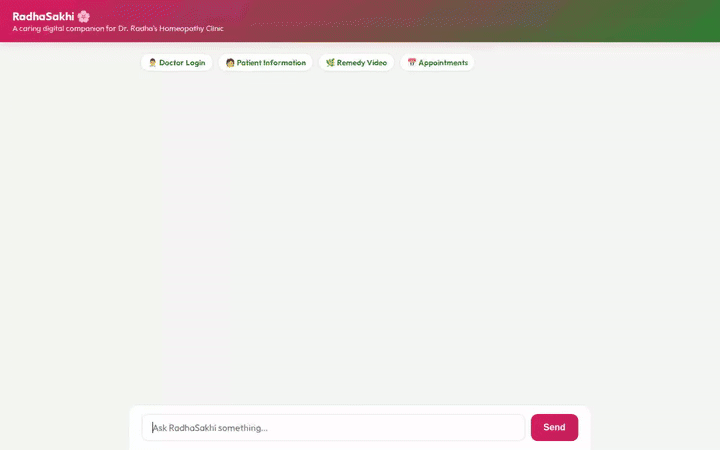

# RadhaSakhi 🌸 — Clinical Care Multi-Agent System

RadhaSakhi 🌸 is a specialized digital companion and multi-agent assistant designed for Dr. Radha's Homeopathy Clinic. Built on the Google Agent Development Kit (ADK) and `agents-cli`, RadhaSakhi assists both patients and practitioners throughout the clinical continuum: patient intake, emergency red-flag safety triage, grounded materia medica research, appointment scheduling, practitioner documentation, remedy inventory, and longitudinal follow-up tracking.



---

## 🚀 Key Capabilities & Implemented Tools

RadhaSakhi is equipped with a suite of custom ADK tools and callback handlers implemented in Python under `app/tools/`:

### 🚨 Red-Flag Safety & Emergency Triage
- **`screen_red_flags`**: Evaluates patient symptom disclosures for critical emergency conditions (e.g. chest pain, acute dyspnea, stroke signs, severe trauma). Returns an immediate `RED_FLAG_ALERT` directing the user to 911 or emergency services before non-emergency routines proceed.

### 📋 Patient Intake & Case Documentation
- **`generate_case_sheet`**: Collects and structures demographics, chief complaints, symptom duration, subjective pain scores (1-10), aggravating/ameliorating factors, medical history, and allergies into a standardized clinical case sheet.
- **`generate_practitioner_documentation`**: Generates practitioner notes (HPI, observations, treatment plan, follow-up schedule). Enforces a mandatory practitioner review status (`DRAFT_PENDING_PRACTITIONER_REVIEW` → `APPROVED_AND_SAVED`).

### 📚 Grounded Remedy Research
- **`research_remedy_reference`**: Queries materia medica reference materials (e.g., Boericke) based on practitioner-validated symptom profiles. Returns source citations, symptom correspondence match percentages, and uncertainty disclaimers.

### 💾 Firestore Patient Record Storage
- **`save_patient_case`**: Persists patient intake sheets and case notes directly into Google Cloud Firestore.
- **`get_patient_case`**: Retrieves a specific patient's case record by Patient ID or Case ID.
- **`list_patient_cases`**: Lists all active or historical patient cases stored in Firestore.

### 🌿 Remedy Inventory & FDA Compliance
- **`check_remedy_inventory`**: Checks stock availability, potency levels (e.g., 30C, 200C), and storage locations for requested remedies.
- **`fetch_fda_label_safety_info`**: Retrieves FDA label compliance and safety guidance for homeopathic products.

### 🎨 Visual & Video Generation
- **`generate_remedy_illustration`**: Generates high-quality botanical illustrations of remedies using Vertex AI Imagen.
- **`generate_remedy_video`**: Generates educational remedy videos using Google's Omni model (`gemini-omni-flash-preview`) in location `global`. Saves artifacts via ADK `ToolContext.save_artifact` and publishes public URLs to Google Cloud Storage.

### 📅 Scheduling & Follow-Up Tracking
- **`check_availability`**, **`book_appointment`**, **`reschedule_or_cancel`**: Manages clinic appointment slots and follow-ups.
- **`analyze_follow_up_progress`**: Analyzes longitudinal progress between visits, calculating severity score deltas (-10 to +10) and evaluating treatment compliance.

### 🧠 Long-Term Memory & A2UI
- **Vertex AI Memory Bank**: Integrates `VertexAiMemoryBankService` (`load_memory`, `preload_memory`) to remember patient context (such as known allergies and history) across sessions.
- **A2UI Card Callback**: Uses `A2uiSchemaManager` (v0.8) and `BasicCatalog` (`after_model_callback`) to render rich visual cards directly in the user interface.

---

## ☁️ Google Cloud Services Integrated

- **Google Cloud Firestore**: Persists patient cases and clinical notes.
- **Google Cloud Storage**: Stores generated remedy media and assets in bucket `clinical-care-assets-41628e`.
- **Vertex AI Memory Bank**: Serves long-term memory for patient context and allergy persistence.
- **Vertex AI Imagen**: Powers botanical remedy illustration generation.
- **Vertex AI Omni Model (`gemini-omni-flash-preview`)**: Generates short educational videos for remedies in location `global`.

---

## 💻 Local Setup & Execution

### Prerequisites
- Python 3.10+
- `uv` or `pip`
- Google Cloud SDK (`gcloud`) authenticated with a GCP Project

### 1. Install Dependencies
```bash
git clone <repository-url>
cd clinical-care-agent
uv sync
```

### 2. Run Terminal CLI Mode
```bash
agents-cli run "Hello, I am a Patient needing intake for joint pain and swelling."
```

### 3. Run Web Playground
```bash
uv run adk web . --port 8080 --reload_agents
```

### 4. Run Custom FastAPI Frontend & Proxy
```bash
export AGENT_ENGINE_RESOURCE_NAME="projects/<project-number>/locations/us-east1/reasoningEngines/<engine-id>"
export AGENT_DIRECTORY="app"
python frontend/main.py
```
